<h2>Activité Pratique 2 : Mise en oeuvre d'une architecture micro-services</h2> 
<h2>Objectifs :</h2>

Créer une application basée sur une architecture micro-service qui permet de gérer les factures contenant des produits et appartenant à un client.
  

<h3>Question 1</h3>

Créer le micro-service customer-service qui permet de gérer les client

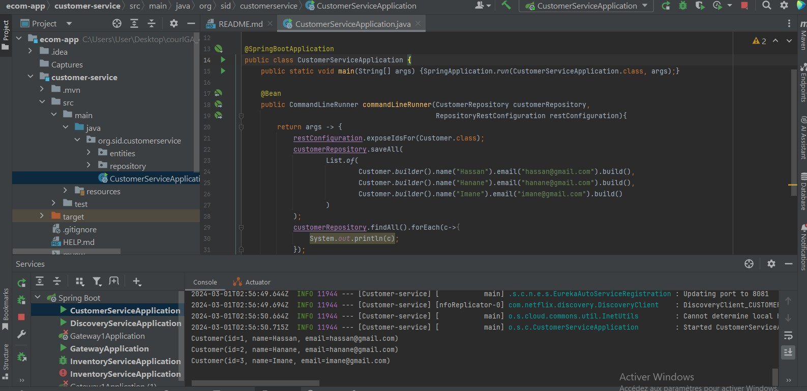 

 - Visualiser la base de données customers-db

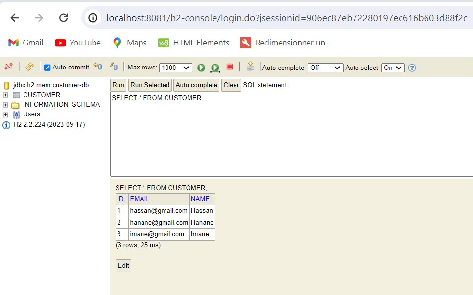 

 - Consultation du web service grace a spring data rest: avec le numéro de port 8081

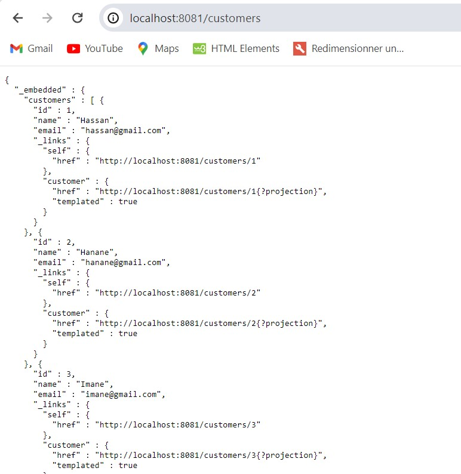  

<h3>Question 2</h3>

Créer le micro-service inventory-service qui permet de gérer les produits

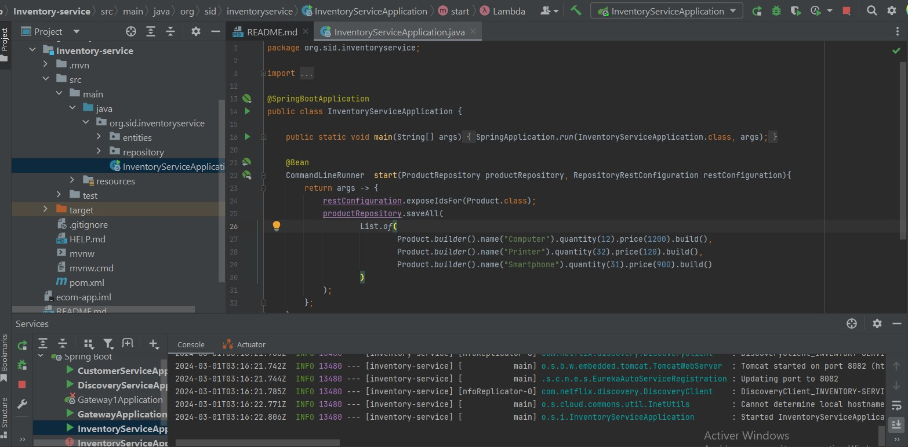 

 - Visualiser la base de données products-db

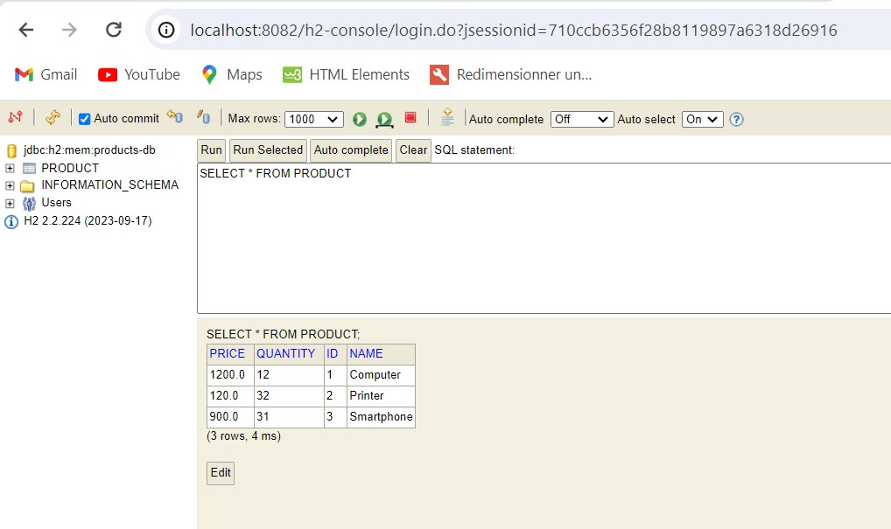 

 - Consultation du web service grace a spring data rest: avec le numéro de port 8082

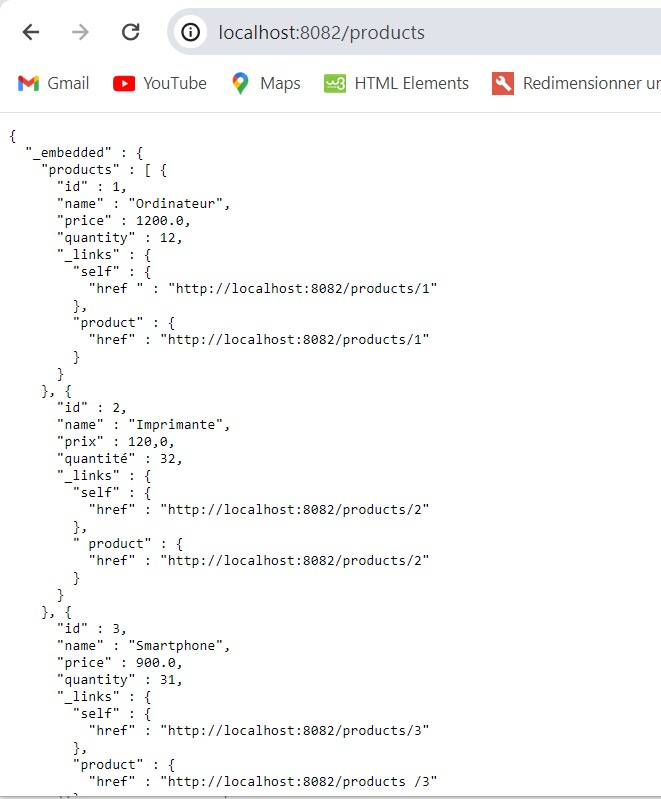  

<h3>Question 3</h3>

Créer la Gateway Spring cloud Gateway

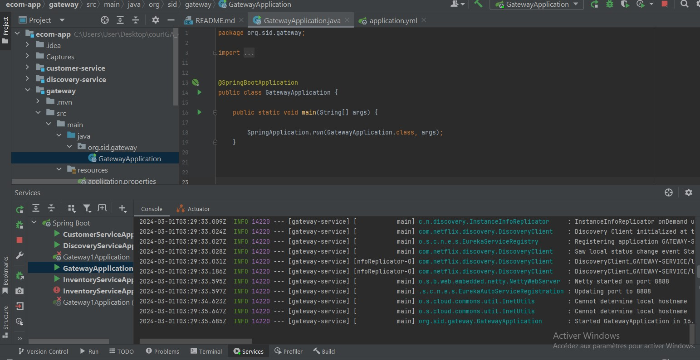  

<h3>Question 4</h3>

 Configuration statique du système de routage

 - Via le fichier application.yml

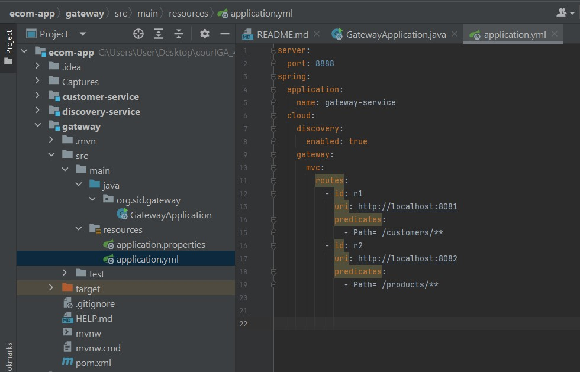 

 - Directement depuis le fichier d'exécution "GatewayApplication"

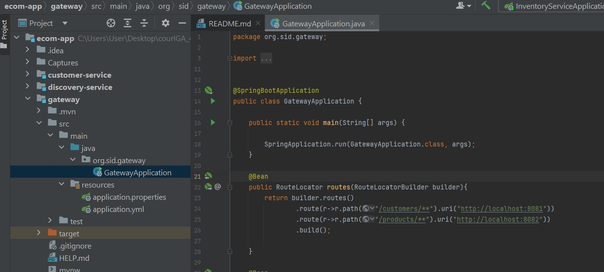 

 - Test : affichage de la liste des customers depuis la gateway avec le numéro de port 8888

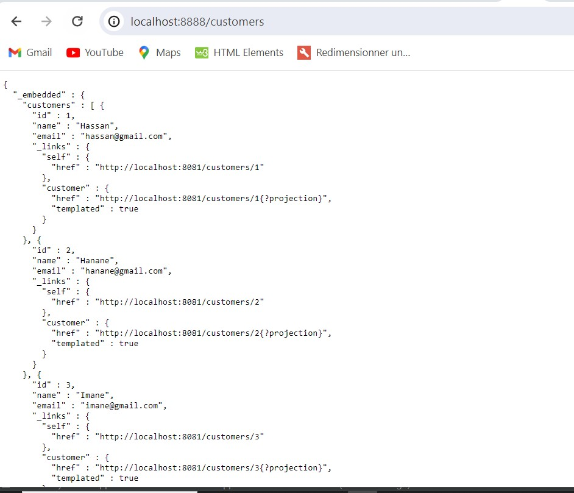 

 - Test : affichage de la liste des products depuis la gateway avec le numéro de port 8888

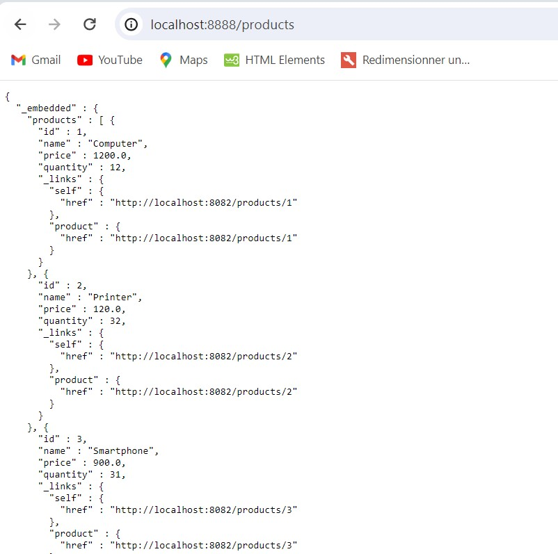  

<h3>Question 5</h3>

Créer l'annuaire Eureka Discrovery Service

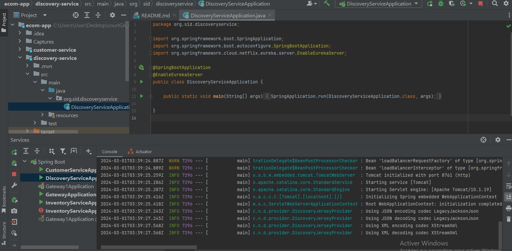 

Liste des web services crées via le port : 8761

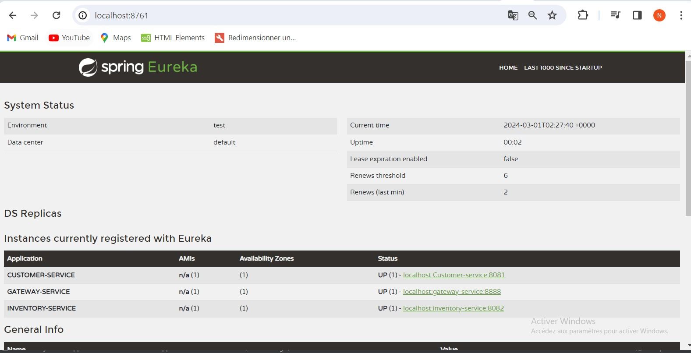  

<h3>Question 6</h3>

 Faire une configuration dynamique des routes de la gateway

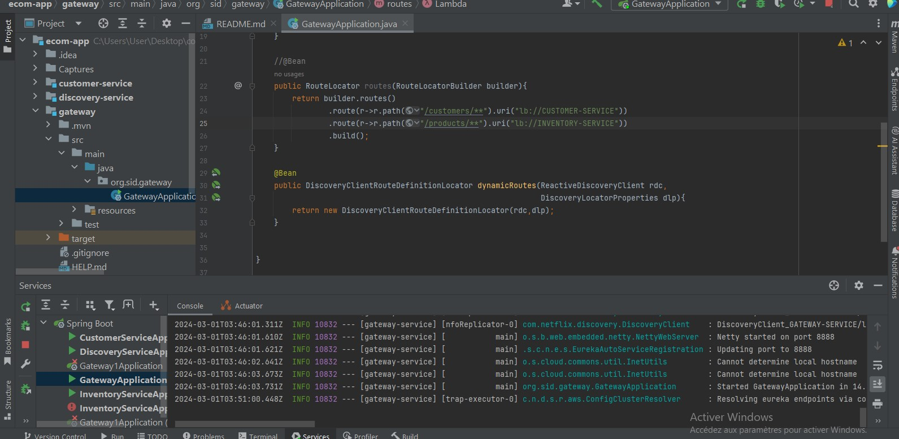 

Consulter le web service grace a son nom : CUSTOMER-SERVICE

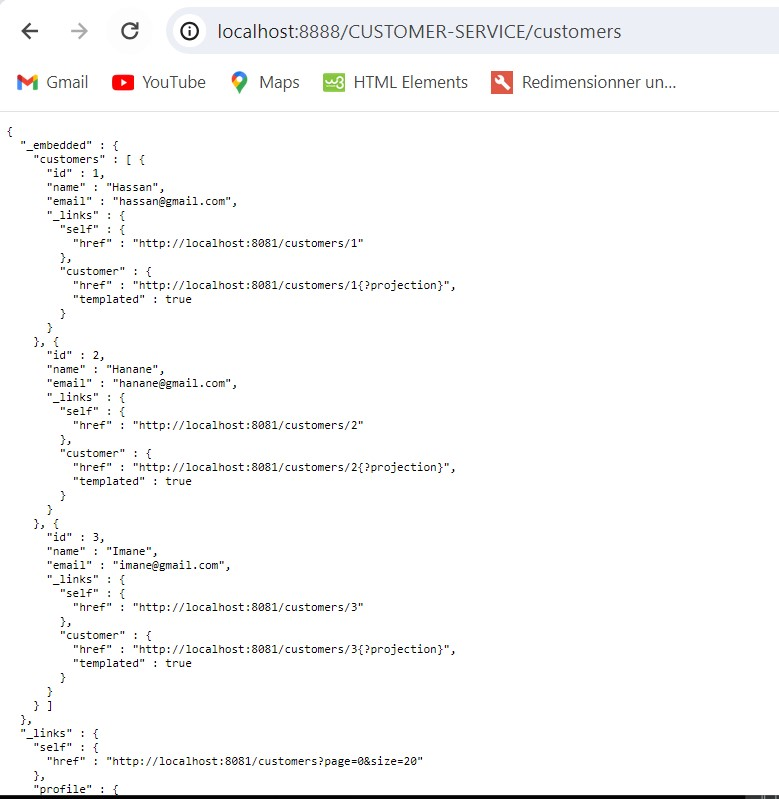 

Consulter le web service grace a son nom : INVENTORY-SERVICE

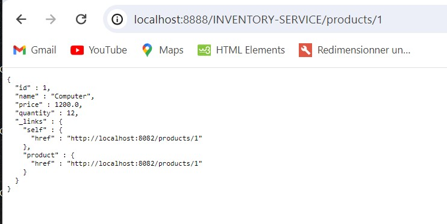  